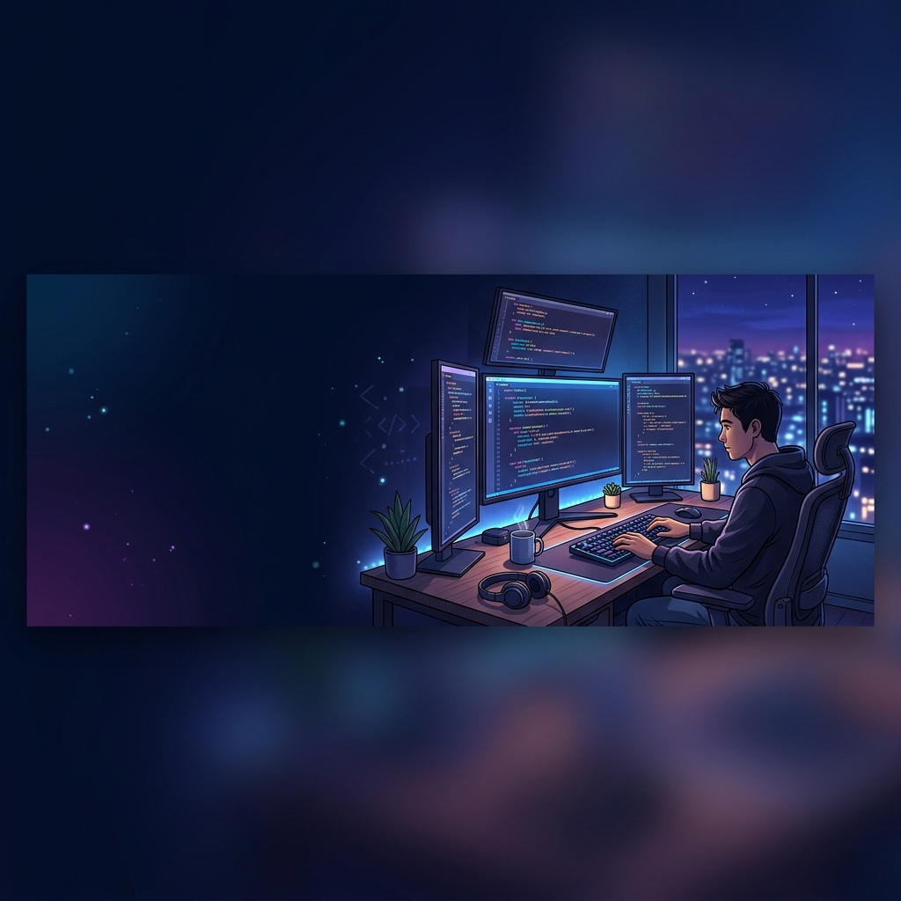

<!-- HERO BANNER -->

---

<!-- TECH STACK -->
<h2 align="center">🛠️ Tecnologías y Herramientas</h2>

  
  
  
  
  
  
  
  
  
  

---

<!-- GITHUB STATS -->
<h2 align="center">📊 Estadísticas de GitHub</h2>

  
  

 

  

 

  

---

<!-- CURRENTLY -->
<h2 align="center">⚡ Actualmente</h2>

  🎓 Aprendiendo nuevas tecnologías  
  🚀 Construyendo proyectos increíbles  
  🎨 Mejorando UI/UX cada día  
  💼 Trabajando en mi propia empresa <a href="https://avorainc.com">AvoraInc</a>

---

<!-- FEATURED PROJECTS -->
<h2 align="center">🚀 Proyectos Destacados</h2>

<table width="100%" border="0" cellspacing="10" cellpadding="0">
  <tr>
    <!-- CARD 1: Avora-Web -->
    <td width="33.3%" valign="top" style="border: 1px solid #30363d; border-radius: 8px; padding: 15px; background: #0d1117;">
      <h3 style="margin-top: 0; display: flex; align-items: center; gap: 8px;">
        📁 Avora-Web 
        
      </h3>
      
Sitio web corporativo para Avora Arquitectura. Landing page moderna con animaciones y diseño responsivo.

       
      
      
      
        
      <table width="100%" border="0" cellspacing="0" cellpadding="0">
        <tr>
          <td>⭐ 12 &nbsp;&nbsp; 🍴 5</td>
          <td align="right"><a href="https://github.com/DavidCM28/Avora-Web">Ver repositorio ➔</a></td>
        </tr>
      </table>
    </td>
    <!-- CARD 2: plataforma-educativa -->
    <td width="33.3%" valign="top" style="border: 1px solid #30363d; border-radius: 8px; padding: 15px; background: #0d1117;">
      <h3 style="margin-top: 0; display: flex; align-items: center; gap: 8px;">
        📁 plataforma-educativa 
        
      </h3>
      
Plataforma educativa con panel de administración, gestión de cursos, usuarios y evaluaciones.

       
      
      
      
        
      <table width="100%" border="0" cellspacing="0" cellpadding="0">
        <tr>
          <td>⭐ 9 &nbsp;&nbsp; 🍴 3</td>
          <td align="right"><a href="https://github.com/DavidCM28/plataforma-educativa">Ver repositorio ➔</a></td>
        </tr>
      </table>
    </td>
    <!-- CARD 3: ECM-Diesel -->
    <td width="33.3%" valign="top" style="border: 1px solid #30363d; border-radius: 8px; padding: 15px; background: #0d1117;">
      <h3 style="margin-top: 0; display: flex; align-items: center; gap: 8px;">
        🛒 ECM-Diesel 
        
      </h3>
      
Tienda en línea para venta y reparación de ECM/ECU. Incluye carrito, pagos y panel de usuario.

       
      
      
      
        
      <table width="100%" border="0" cellspacing="0" cellpadding="0">
        <tr>
          <td>⭐ 7 &nbsp;&nbsp; 🍴 2</td>
          <td align="right"><a href="https://github.com/DavidCM28/ECM-Diesel">Ver repositorio ➔</a></td>
        </tr>
      </table>
    </td>
  </tr>
</table>

  

---

<!-- CONNECT -->
<h2 align="center">🌐 Conéctate conmigo</h2>

  
  
  

---

<!-- FOOTER QUOTE -->

> *"El código es como el humor. Cuando tienes que explicarlo, es malo."* — **Cory House**

 

